# GALLO

To perform gene annotation we are gonna use the package GALLO

To use GALLO you need three different imput file:
<ul>
<li> GWAS output
<li> QTL position 
<li> GENE postion
</il>


## QTL position

Acess the website <https://www.animalgenome.org/cgi-bin/QTLdb/index> and hit the link for your specie

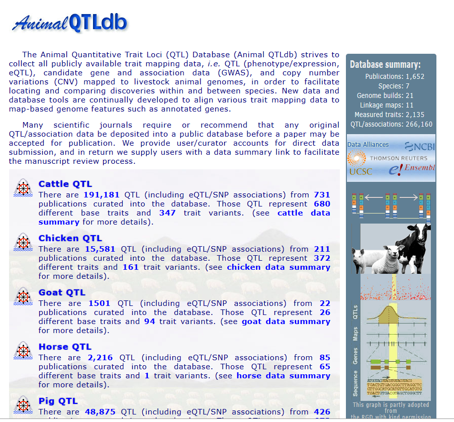

Now download the file, but pay attention to get the <span style="background-color: yellow;"> **.gff** format</span> and the correct version for yourHere is some text that <span style="background-color: #00FF00;">reference genome</span>.
 
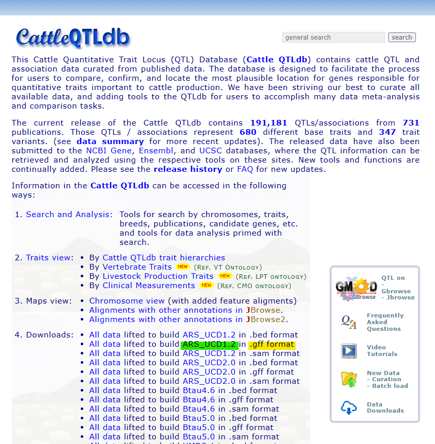

## GENE position

Acess the **Ensemble FTP download** page  <https://www.ensembl.org/info/data/ftp/index.html?redirect=no> to download the **.gtf** file

Use the <span style="background-color: #00FF00;">seach area</span> to find your specie, and than download the <span style="background-color: yellow;">GTF file</span>.

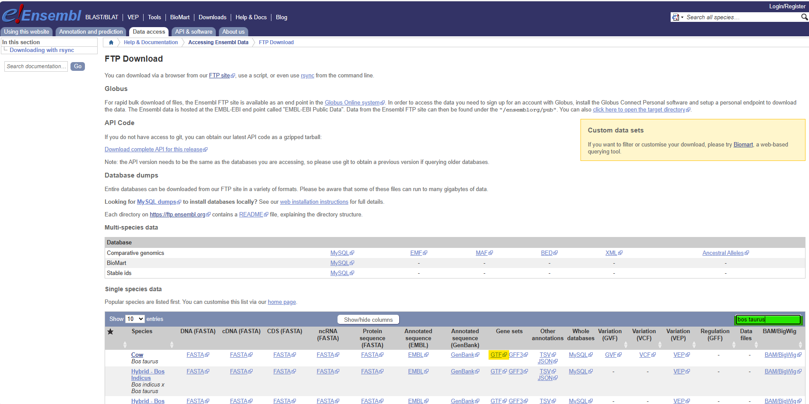

It is also important double check the reference genome from which you are downloading the gene position. This must be the same genome reference version that the *.map* file you have used. To do this, hit the specie <span style= "background-color: #00FFFF;">name</span>, 

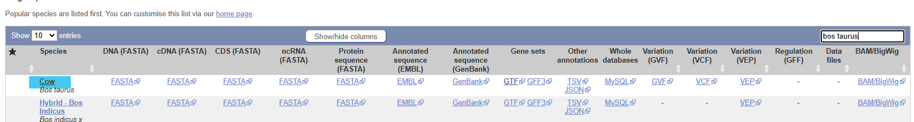

than check on the left top corner the Reference Genome version. If you need to change, use the <span style="background-color: #00FF00;">drop down menu</span>, and be sure to hit the **GO** buton.

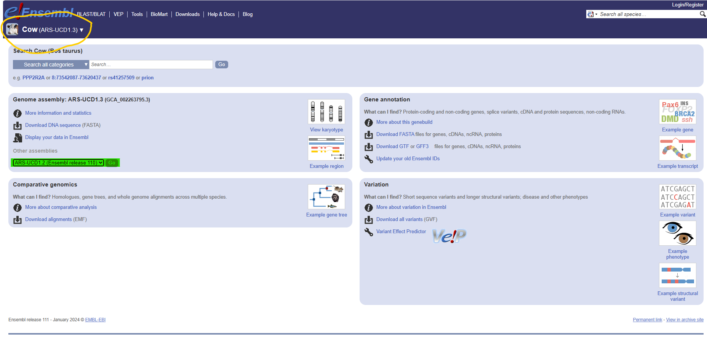

Now check again in the top left corner the genome reference version, and click on <span style="background-color: #00FF00;">Download GTF</span>

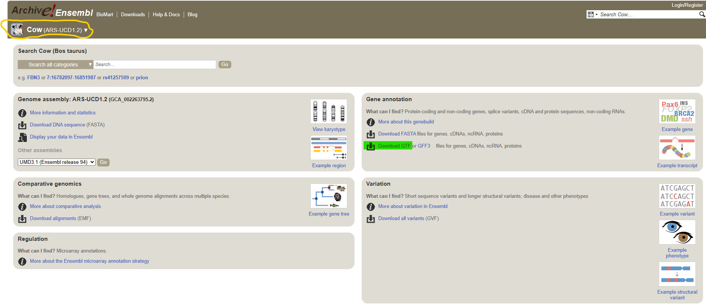

And download the  <span style="background-color: #00FF00;">gtf file</span>.

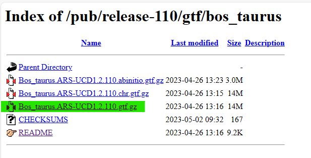

Now you have the two files with gene and QTL position for your reference genome. 

## Significant Markers

The last file that you need is the output of your GWAS analysis, the file with the Chromosome, SNP name and SNP position for your significant SNPs.

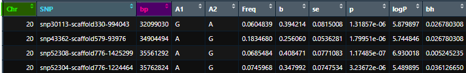

## find_genes_qtls_around_markers function

Now you are gonna need to load the three imput files as in the code below. 

Than you are gonna run the function **find_genes_qtls_around_markers** setting up the correct method choosing **GENE** or **QTL**.

You also need to choose the proper **interval** that is the range that GALLO will check upstream and downstream of you SNP position.

```{r eval=FALSE}

#import a QTL annotation file
qtl_dbb <- import_gff_gtf(db_file="/Animal_QTLdb_release52_goatCHIR_ARS1.gff.gz",file_type="gff")

#import a gene annotation file
gene_dbb <- import_gff_gtf(db_file="/Capra_hircus.ARS1.111.gtf.gz",file_type="gtf")

#import MARKER files = the GWAS output
gwas <- read.table(file = "/SNP_sig_BH.txt", 
                   head=T, stringsAsFactors = F)

# Assuming "gwas" is your dataframe
gwas <- subset(gwas, select = c(Chr, SNP, bp))


colnames(gwas) <- c("CHR","SNP", "BP")


#FINDING GENES AND QTLs ARROUND THE MARKER

#FINDING GENES
out.genes <- find_genes_qtls_around_markers(db_file= gene_dbb, 
                                            marker_file= gwas, 
                                            method = "gene",
                                            marker = "snp", 
                                            interval = 50000, 
                                            nThreads = NULL)

write.table(out.genes, file = "/out_genes_50k.txt", 
            quote = FALSE, sep = "\t", row.names = FALSE, col.names = T)

#FINDING QTLs

out.qtl <- find_genes_qtls_around_markers(db_file= qtl_dbb, 
                                          marker_file= gwas, 
                                          method = "qtl",
                                          marker = "snp", 
                                          interval = 50000, 
                                          nThreads = NULL)

write.table(out.qtl, file = "/out_qtl_50k.txt", 
            quote = FALSE, sep = "\t", row.names = FALSE, col.names = T)
```

Now, as output you have two files with the Genes and QTL surrounding your SNP into your interval.

**GENE**
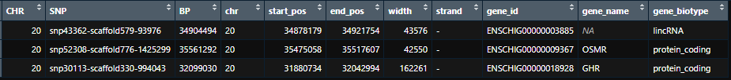

**QTL**
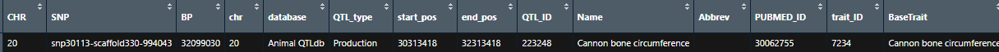


## Pie chart

With this function you are gonna plot the percentage of each QTL class annoatted

```{r eval=FALSE}

par(mar=c(1,30,1,1))
plot_qtl_info(out.qtls, qtl_plot = "qtl_type", cex=2)

```

## Bar chart
plotting the percentage of each trait annoatted for a determined class of QTL, for instance *Reproduction QTL*
```{r eval=FALSE}

par(mar=c(5,20,1,1))
plot_qtl_info(out.qtls, qtl_plot = "qtl_name", qtl_class="Reproduction")
```

## QTL enrichment 

You need to set up different parameter to check the p-value for each QTL
<ul>
<li>qtl_db = the .gff file
<li>qtl_file = the first output from Gallo with the surrounding QTLs
<li>qtl_type = c(“QTL_type”, “trait”),
<li>enrich_type = c(“genome”, “chromosome”), 
<li>chr.subset = NULL, 
<li>nThreads = NULL, 
<li>padj = c(“holm”, “hochberg”,“hommel”, “bonferroni”, “BH”, “BY”, “fdr”, “none”))
</ul>

```{r eval=FALSE}
#QTL enrichment analysis 


out.enrich<-qtl_enrich(qtl_db= qtl_dbb, 
                       qtl_file= out.qtl, qtl_type = "Name",
                       enrich_type = "chromosome", chr.subset = NULL, 
                       padj = "fdr",nThreads = 2)
 
```

The output has this columns

<ul>
<li>QTL: The QTL class or trait used for the enrichment;
<li>CHR: The chromosome for that specific QTL or trait (if the option “chromosome” is informed to the argument enrich_type);
<li>N_QTLs: Number of observed QTLs or traits in the dataset; 
<li>N_QTLs_db: Number of each annotated QTL in the qTL database; 
<li>Total_annotated_QTLs: Total number of annotated QTLs; 
<li>Total_QTLs_db: Total number of QTLs in the QTL database;
<li>pvalue: P-value for the enrichment analysis; 
<li>adj.pval: The adjusted p-value based on the multiple test correction selected by the user;
<li>QTL_type= The QTL type for each annotated trait.
</ul>


## QTLenrich_plot

You need to set up the following parameters
<ul>
<li>qtl_enrich: The output from qtl_enrich function
<li>x: ID column to be used from the qtl_enrich output
<li>pval: P-value to be used in the plot. If “p_value” informed, a non-adjusted pvalue will be plotted. If “p.adj” informed, the adjusted p-value from the qtl enrichment analysis will be plotted.

Before plot the enrichment results, a new ID column will be created in order to make easier to identify the enrichment results per chromosome. Additonally, we are going to match the QTL classes for each trait and filter the top 10 enriched QTLs.

Creating a new ID composed by the trait and the chromosome
```{r eval=FALSE}
out.enrich$ID<-paste(out.enrich$QTL," - ","CHR",out.enrich$CHR,sep="")
```

Match the QTL classes and filtering the Reproduction related QTLs
```{r eval=FALSE}
out.enrich.filtered<-out.enrich[which(out.enrich$adj.pval<0.05),]
```

Plotting the enrichment results for the QTL enrichment analysis
```{r eval=FALSE}
QTLenrich_plot(out.enrich.filtered, x="ID", pval="adj.pval")
```

# Getting the rsID

The rsID is a "stable" ID that doesn't change along the time. So is a better use than "comercial" SNP Name. We are gonna get this IDs using the website **SNPchimp** <https://webserver.ibba.cnr.it/SNPchimp/index.php/links>

Using the tab BROWSE hit the link for your specie.

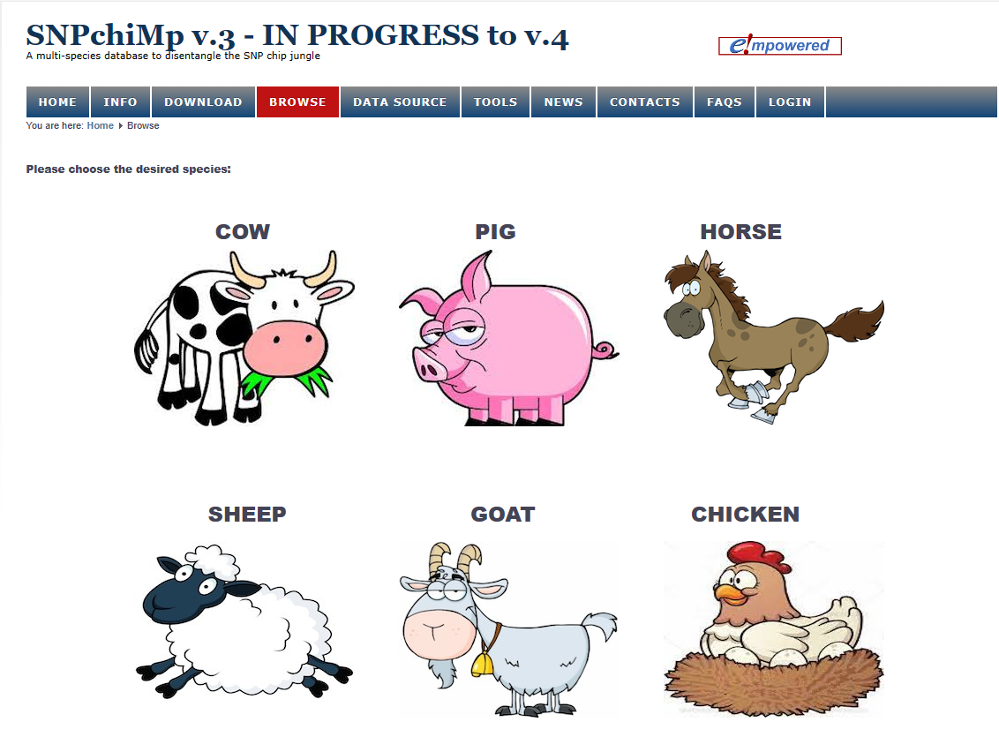

Now, paste your SNPnames in the <span style="background-color: #00FF00;">search area</span> separated by comma.

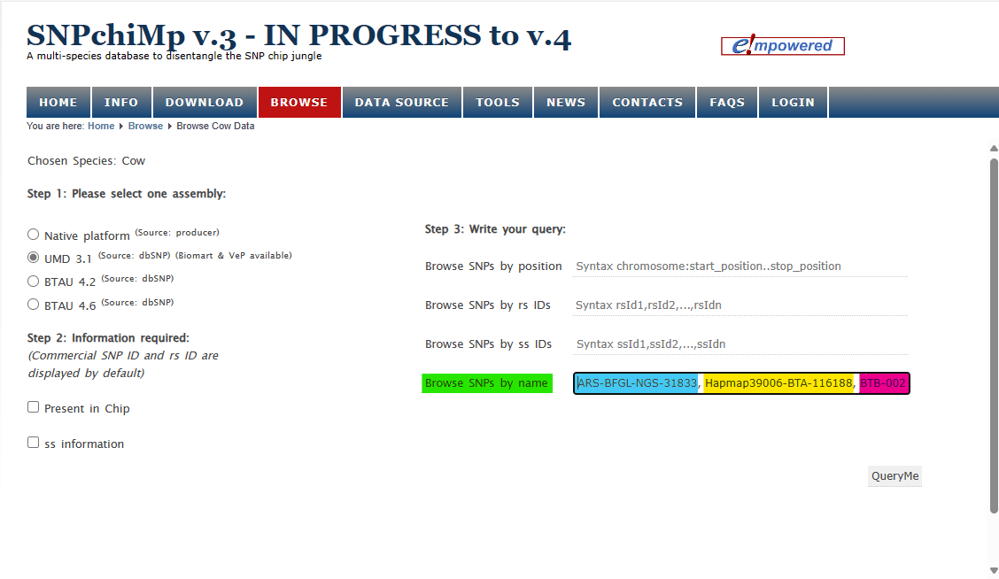

Now you have your <span style="background-color: #00FF00;">rsID</span> and you can <span style="background-color: yellow;">download</span> this output in CSV or TSV format.

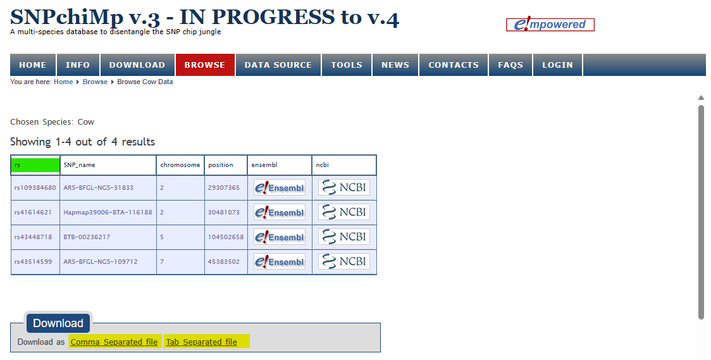

# GENE ONTOLOGY

## amiGO / Panther

<https://amigo.geneontology.org/amigo>

## GPROFILER

```{r eval=FALSE}
### enriquecimento genico
#install.packages("gprofiler2")
library(gprofiler2)

#Para conferir a lista de organism -> https://biit.cs.ut.ee/gprofiler/page/organism-list

#Obs: eu entro com os ids ENSOAR...
query <- read.table ("/out_genes_60k.txt", header = T)
query <- query[,c("gene_id")]

gene_enrich <- gost(
  query,
  organism = "chircus", #o de cabra é "chircus"
  ordered_query = FALSE,
  multi_query = FALSE,
  significant = TRUE,
  exclude_iea = FALSE,
  measure_underrepresentation = FALSE,
  evcodes = TRUE,
  user_threshold = 0.10,
  correction_method = c("fdr"),
  domain_scope = c("annotated"),
  numeric_ns = "",
  sources = NULL,
  as_short_link = FALSE,
  highlight = FALSE
)


#str(gene_enrich) # para ver o formato dos meus dados

#selecionando apenas as informações da lista que me interessam para fazer meu data.frame 
result_enrich <- data.frame(gene_enrich$result)
result_enrich <- data.frame(Category = result_enrich$source,
                            ID = result_enrich$term_id,
                            Term = result_enrich$term_name,
                            adj_pvalue = result_enrich$p_value,
                            id_ensembl = result_enrich$intersection)

write.table(result_enrich,"/home/bambrozi/Sec_ARS1_GrassHill_1/GPROFILER/gene_enrich.txt", col.names=TRUE, row.names=FALSE, sep="\t", quote=F)


gostplot(
  gene_enrich,
  capped = TRUE,
  interactive = T,
  pal = c(`GO:MF` = "#dc3912", `GO:BP` = "#ff9900", `GO:CC` = "#109618", KEGG =
            "#dd4477", REAC = "#3366cc", WP = "#0099c6", TF = "#5574a6", MIRNA = "#22aa99", HPA =
            "#6633cc", CORUM = "#66aa00", HP = "#990099")
)

#to use this function to save, it is necesssary choose interactive =F in the previous step
#to use this function create a object "publish_gostplot" in the previous step.
publish_gostplot(
  gostplot_obj,
  highlight_terms = NULL,
  filename = NULL,
  width = NA,
  height = NA
)

#CREATE A TABLE

publish_gosttable(
  gene_enrich,
  highlight_terms = NULL,
  use_colors = TRUE,
  show_columns = c("source", "term_name", "term_size", "intersection_size"),
  filename = "result_table.pdf",
  ggplot = TRUE
)
```

# METABOLIC PATHWAYS

## REACTOME <https://reactome.org/>

## DAVID

# GENE NETWORKS

## STRING <https://string-db.org/>

## NETWORK ANALYST <https://www.networkanalyst.ca/>

# VARIANT EFFECT PREDICTOR (VEP) <https://www.ensembl.org/Homo_sapiens/Tools/VEP>
